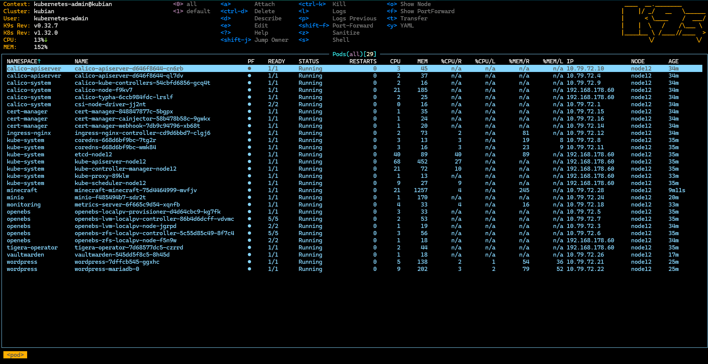

# Quickstart
You need a clean Debian Linux version 12 (bookworm) with 4CPU, 8GB RAM and 40GB DISK.
All commands are executed as root.  

## 1. Build Kubian setup package
```bash
cd ~
apt install -y git
git clone https://github.com/bihalu/kubian.git
cd kubian
./kubian-build-1.32.0.sh
```
Takes about 15 minutes ...  
coffe break ;-)

## 2. Setup kubernetes single node cluster 
```bash
./kubian-setup-1.32.0.tgz.self init single nfs
```
Takes about 5 minutes ...  
almost done   

## 3. Inspect your kubernetes cluster with k9s
You can have a look at the cluster with k9s tool.  

```bash
k9s
```


Pods are running.  

## Summary
You can set up a kubernetes cluster in under half an hour. If you have already built the setup and app package it is even faster. Save these packages on a usb stick and you can quickly set up a kubernetes cluster in no time.  

``/\_/\``  
``(='_')``   
``(,(")(")`` 
